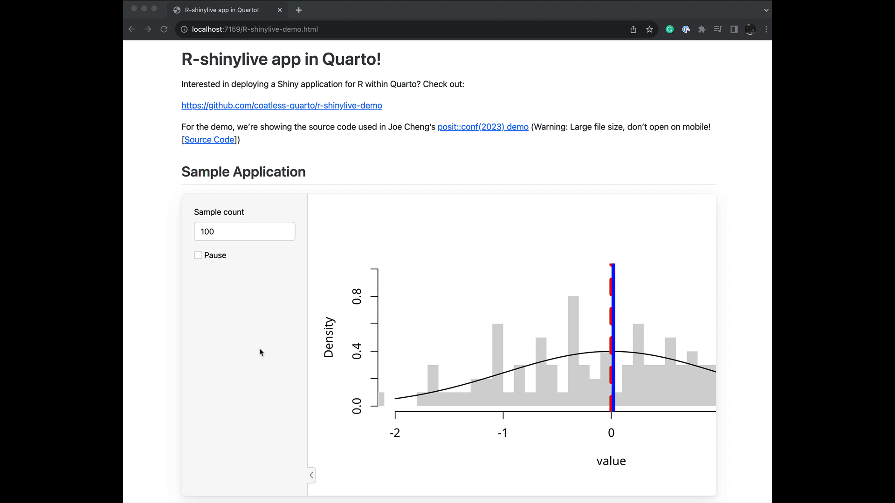
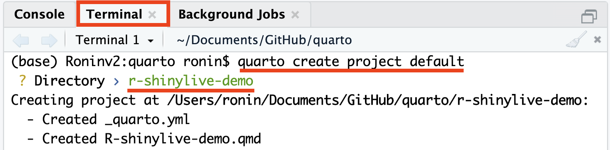
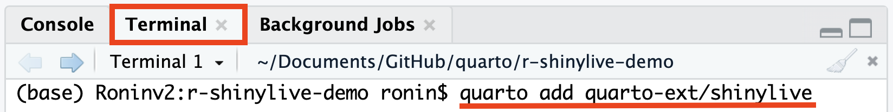
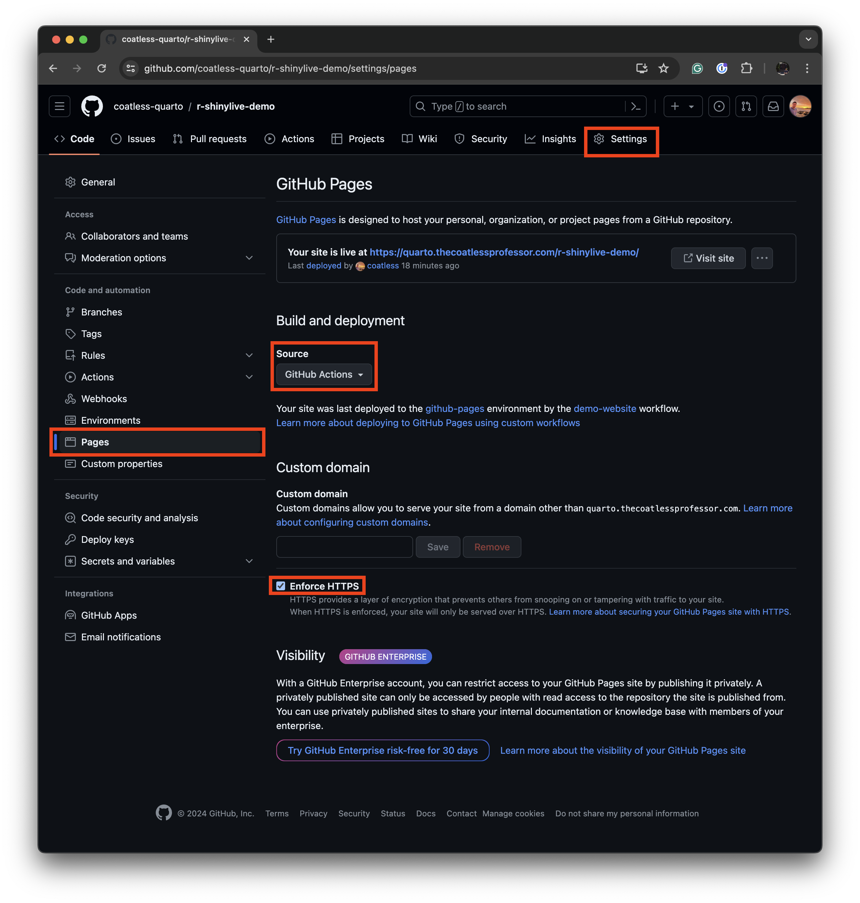

# Creating an R Shinylive App inside a Quarto Document

Interested in deploying a serverless Shiny application for R within Quarto? This is the repository for you! Here's a summary of what you can find in the repository:

- **[index.qmd](index.qmd):** This file contains a tutorial that provides step-by-step instructions and guidance on using `r-shinylive` to embed Shiny applications in Quarto documents.

- **[R-shinylive-demo.qmd](R-shinylive-demo.qmd):** Inside this file, you can find a working example of the Shiny app that was used in Joe Cheng's [posit::conf(2023) demo](https://jcheng5.github.io/posit-conf-2023-shinylive/#/option-3-include-1). Please note that Joe's presentation contains files that are large in size and is not recommended for mobile devices. You can also refer to the [source code](https://github.com/jcheng5/posit-conf-2023-shinylive/blob/d385ad18eb0d867f25cc4721d9e8c25aeb2dfb90/slides.qmd#L299) of the demo.

- **[template-r-shinylive.qmd](template-r-shinylive.qmd):** This file provides a skeleton template that you can use to populate your own Shiny apps. It serves as a starting point for creating your interactive Quarto documents with Shiny applications. Please note that you will still need to install the required software as mentioned in the tutorial.

- **[_quarto.yml](_quarto-default.yml):** This configuration file is essential for Quarto and `shinylive` to work together effectively. 

- **[.github/workflows/publish-demo.yml](.github/workflows/publish-demo.yml):** This file contains a sample workflow configuration for creating a website that embeds R Shiny applications using GitHub Actions and deploys it to GitHub Pages.

Let's dive in! 

> [!NOTE]
>
> Please note that this guide is **not** affiliated with Posit, Quarto, Shiny,
> or Shinylive project. It is a community-driven tutorial to help you get started
> using Shinylive with Quarto. 

### Other Guides

- Creating an R Shinylive App inside a Quarto Document
- [Deploying an R Shinylive App via GitHub Pages through GitHub Actions](https://github.com/coatless-tutorials/convert-shiny-app-r-shinylive)
- [Data Inclusion in a Shinylive App](https://tutorials.thecoatlessprofessor.com/r-shinylive-data-include/)
- [Deploying an R Shiny Dashboard App through R Shinylive](https://github.com/coatless-dashboard/r-shinylive-dashboard-app)
- [Deploying a Python Shinylive App via GitHub Pages through GitHub Actions](https://github.com/coatless-tutorials/convert-py-shiny-app-to-py-shinylive-app)

### Updates

- **3/17/2025**
  - We've bumped the version of the `shinylive` R package to v0.3.0, upgraded
    the `quarto-shinylive` extension included in the repository, and 
    updated the version of GitHub Actions to either v3 or v4 to avoid deprecation
    warnings.
- **8/01/2024**
  - We've updated the pinned version of the `shinylive` R package to v0.2.0 to
    gain access to improvements regarding webR v0.4.0 and packaging `shiny`
    packages with the deployment to improve reproducibility.
- **4/25/2024**
  - We've switched how we used GitHub Pages to deploy Quarto website 
    to use GitHub Actions instead of committing into the GitHub Pages branch.
  - We've also pinned the version of `shinylive` being used to v0.1.1 to ensure
    consistency with the `quarto-ext/shinylive` Quarto extension.
- **10/26/2023**
  - We've updated the version of `shinylive` being used to v0.1.0 to ensure
    consistency with the `quarto-ext/shinylive` Quarto extension.
  - Ensured that `bslib` was loaded for the `page_sidebar()` function.
- **09/21/2023**
  - Initial release of the tutorial.

## Sample App

We'll be walking through the process of creating the following R Shinylive application.



You can see the live version built from the repository here:

<https://coatless-quarto.github.io/r-shinylive-demo/>

## Video Tutorial

Prefer a hands-on visual guide? Check out the following YouTube video:

[](https://www.youtube.com/watch?v=6y2FnAugP8E)

We'll go through every step and provide some commentary along the way!

# Using r-shinylive for Serverless Shiny Apps in Quarto Documents

Are you interested in creating your own Quarto document with embedded static Shiny apps? This tutorial will guide you through the process of using the `r-shinylive` R package to achieve just that. Let's get started!

## Installation

**Step 1:** Install the `r-shinylive` R package from CRAN. It can be obtained from the R console using the following command:

```r
install.packages("shinylive")
```

> [!NOTE]
> 
> This step differs from when the tutorial and video were written as the 
> `shinylive` package was only able to be obtained from GitHub.

## Setting Up Your Quarto Project

**Step 2:** Create a new Quarto project. Open your terminal and execute the following command:

```sh
quarto create project default
```




While creating the project, you'll be prompted to specify a directory name. This name will also serve as the filename for your Quarto document. It's crucial to note that skipping this step will result in the absence of a `_quarto.yml` file, leading to an error when you attempt to render the document. The error message will resemble the following:

```md
ERROR:
The shinylive extension must be used in a Quarto project directory
(with a _quarto.yml file).
```

Ensure that the contents of the `_quarto.yml` file match the following structure:

```yaml
project:
  title: "R-shinylive-demo"
```

Here, the `title` field should contain the name of the Quarto file up to the extension.

## Installing the Quarto Extension for r-shinylive

**Step 3:** Install the Quarto extension for `shinylive`. In the Terminal tab, run the following command:

```sh
quarto add quarto-ext/shinylive
```



## Including the Shiny App in Your Quarto Document

**Step 4:** To include a Shiny app directly in your Quarto file (`.qmd`), you need to add a filter key for `shinylive` at the top of the desired Quarto file. Open your Quarto file and add the following YAML header:

```yaml
filters:
  - shinylive
```

**Step 5:** You can insert the code for a Shiny application in a code block marked with `{shinylive-r}`. Below is a skeletal example of how your code block might look:

````md
---
title: "Our first r-shinylive Quarto document!"
filters:
  - shinylive
---

```{shinylive-r}
#| standalone: true

library(shiny)

# Define your Shiny UI here
ui <- fluidPage(
  # Your UI components go here
)

# Define your Shiny server logic here
server <- function(input, output, session) {
  # Your server code goes here
}

# Create and launch the Shiny app
shinyApp(ui, server)
```
````

Please note that the code block must include `#| standalone: true`, which indicates that the code represents a complete standalone Shiny application. In the future, Quarto will hopefully support Shiny applications with parts spread throughout the document. 

For an example file, you can refer to this bare-bones implementation: [template-r-shinylive.qmd](https://github.com/coatless-quarto/r-shinylive-demo/blob/main/template-r-shinylive.qmd)


With this in mind, let's use Joe's shiny app inside our code block. So, we'll end up using:

````md
```{shinylive-r}
#| standalone: true
#| viewerHeight: 600
library(shiny)
library(bslib)

# Define UI for app that draws a histogram ----
ui <- page_sidebar(
  sidebar = sidebar(open = "open",
    numericInput("n", "Sample count", 100),
    checkboxInput("pause", "Pause", FALSE),
  ),
  plotOutput("plot", width=1100)
)

server <- function(input, output, session) {
  data <- reactive({
    input$resample
    if (!isTRUE(input$pause)) {
      invalidateLater(1000)
    }
    rnorm(input$n)
  })
  
  output$plot <- renderPlot({
    hist(data(),
      breaks = 40,
      xlim = c(-2, 2),
      ylim = c(0, 1),
      lty = "blank",
      xlab = "value",
      freq = FALSE,
      main = ""
    )
    
    x <- seq(from = -2, to = 2, length.out = 500)
    y <- dnorm(x)
    lines(x, y, lwd=1.5)
    
    lwd <- 5
    abline(v=0, col="red", lwd=lwd, lty=2)
    abline(v=mean(data()), col="blue", lwd=lwd, lty=1)

    legend(legend = c("Normal", "Mean", "Sample mean"),
      col = c("black", "red", "blue"),
      lty = c(1, 2, 1),
      lwd = c(1, lwd, lwd),
      x = 1,
      y = 0.9
    )
  }, res=140)
}

# Create Shiny app ----
shinyApp(ui = ui, server = server)
```
````

You can view a standalone version of Joe's app here: [R-shinylive-demo.qmd](https://github.com/coatless-quarto/r-shinylive-demo/blob/main/R-shinylive-demo.qmd)

## Rendering Your Quarto Document

**Step 6:** Once you are satisfied with your Shiny app and content, render the document by pressing the Render button in RStudio.


Or type in the Terminal tab:

```sh
quarto preview R-shinylive-demo.qmd --no-browser --no-watch-inputs
```


## Folder Structure

During the render process, the output directory should contain the following structure:

```sh
.
├── _extensions
│   └── quarto-ext/shinylive # Added by 'quarto add'
├── _quarto.yml              # Created by 'quarto create'
├── R-shinylive-demo.html    # Rendered Document
├── R-shinylive-demo.qmd     # Quarto Document with Shiny App
├── R-shinylive-demo_files   # Supporting files
└── shinylive-sw.js          # Service Worker
```

## Publishing Your Quarto Document

**Step 7:** Once you are satisfied with your shinylive app and Quarto document, it's time to publish your work. There are multiple options for publishing with Quarto, and we'll present two of them. Choose the option that best suits your needs for sharing and distributing your Quarto document with your embedded shinylive app.

**Option 1: Publish to GitHub Pages**

To make your Quarto document accessible on [GitHub Pages via Quarto](https://quarto.org/docs/publishing/github-pages.html), use the following command in your terminal:

```sh
quarto publish gh-pages
```

This option is great if you want to share your document through a GitHub Pages website.

**Option 2: Publish to Quarto Pub**

Alternatively, you can publish your Quarto document on [Quarto Pub via Quarto](https://quarto.org/docs/publishing/quarto-pub.html). Use the following command in your terminal:

```sh
quarto publish quarto-pub
```

This option provides you with a shareable link for easy access by others and is a good choice if you prefer a dedicated platform for your documents.

### A Quick Fix for Service Worker Inclusion

If you've encountered issues with the `quarto publish` command not including the required service worker JavaScript file, you can quickly resolve this by adding the following lines under the `html` key in your document header:

```yaml
format:
  html:
    resources: 
      - shinylive-sw.js
```

This addition ensures that the necessary service worker JavaScript file (`shinylive-sw.js`) is included when you publish your Quarto document. The Quarto team is aware of the issue regarding [service workers not being uploaded automatically from extensions](https://github.com/quarto-dev/quarto-cli/issues/6828).

If you encounter this issue, you may see an error message in your browser's JavaScript console that looks like:

```
Uncaught Error: ServiceWorker controller was not found!
The above error occurred in the <Viewer> component:
```

By implementing this quick fix, you can prevent this error and ensure the proper functioning of your shinylive app within your Quarto document.

## Advanced (Optional Step): Continuous Publishing Using GitHub Actions

For advanced users, you can set up continuous integration (CI) to automatically update your application whenever changes are committed to the Quarto document. This process involves creating a workflow for [GitHub Actions](https://github.com/features/actions) and utilizing actions from [`r-lib/actions`](https://github.com/r-lib/actions) (for R installation) and [`quarto-dev/quarto-actions`](https://github.com/quarto-dev/quarto-actions) (for Quarto setup and publishing).

Follow these steps to configure continuous publishing:

**Step 1:** Create a `.github/` folder in your repository if it doesn't already exist. Place the `workflows/` folder inside it. Then, create a workflow configuration file called `publish-website.yml` with the following content:

```yaml
on:
  push:
    branches: [main, master]
  release:
      types: [published]
  workflow_dispatch: {}

name: demo-website

jobs:
  demo-website:
    runs-on: ubuntu-latest
    # Only restrict concurrency for non-PR jobs
    concurrency:
      group: quarto-website-${{ github.event_name != 'pull_request' || github.run_id }}
    permissions:
      contents: read
      pages: write
      id-token: write
    steps:
      - name: "Check out repository"
        uses: actions/checkout@v4

      # To render using knitr, we need a few more setup steps...
      # If we didn't want the examples to use `engine: knitr`, we could
      # skip a few of the setup steps.
      - name: "Setup pandoc"
        uses: r-lib/actions/setup-pandoc@v2

      - name: "Setup R"
        uses: r-lib/actions/setup-r@v2

      - name: "Setup R dependencies for Quarto's knitr engine"
        uses: r-lib/actions/setup-r-dependencies@v2
        with:
          packages:
            cran::shinylive@0.3.0 ## Pin version to ensure consistency
            any::knitr
            any::rmarkdown
            any::downlit
            any::xml2

      # Back to our regularly scheduled Quarto output
      - name: "Set up Quarto"
        uses: quarto-dev/quarto-actions/setup@v2

      # Render the Quarto file
      - name: "Render working directory"
        uses: quarto-dev/quarto-actions/render@v2

      # Upload a tar file that will work with GitHub Pages
      # Make sure to set a retention day to avoid running into a cap
      # This artifact shouldn't be required after deployment onto pages was a success.
      - name: Upload Pages artifact
        uses: actions/upload-pages-artifact@v3
        with: 
          retention-days: 1
      
      # Use an Action deploy to push the artifact onto GitHub Pages
      # This requires the `Action` tab being structured to allow for deployment
      # instead of using `docs/` or the `gh-pages` branch of the repository
      - name: Deploy to GitHub Pages
        id: deployment
        uses: actions/deploy-pages@v4
```

> [!NOTE]
> We have pinned the version of `shinylive` package on CRAN to v0.3.0 to ensure
> consistency with the `quarto-ext/shinylive` Quarto extension. 

**Step 2:** Enable GitHub Pages deployment using GitHub Actions in your
repository by going to the repository's `Settings` tab, selecting `Pages`, and
then under the build and deployment section set scource to GitHub Actions. Please
make sure to also check the **Enforce HTTPS** option.



By implementing this advanced setup, your Quarto document with the embedded shinylive app will automatically update whenever changes are pushed to the specified branches or when a release is published. This ensures that your audience always has access to the latest version of your interactive document.

# Fin

Now you have successfully integrated static Shiny apps into your Quarto documents using the `r-shinylive` package. Happy Quarto + r-shinyliving!

## References

- [Shinylive R Package](https://github.com/posit-dev/r-shinylive)
- [Shinylive Quarto Extension](https://github.com/quarto-ext/shinylive): Static Shiny apps as Quarto code chunks
